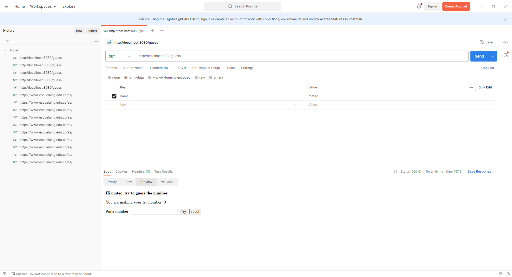

# LABORATORIO 5 - SPRING MVC INTRODUCTION

#### INTRODUCCIÓN A PROYECTOS WEB

### PARTE I. - JUGANDO A SER UN CLIENTE HTTP
Usaremos las siguientes aplicaciones como cliente HTTP
- Postman
- Telnet

Abre la aplicación Postman, lo usaremos para hacer una solicitud a un servidor HTTP, al abrirlo indentifica qué controles de Postman corresponde a los elementos de entrada y salida de un servicio HTTP:

Has un request GET a la URL https://www.escuelaing.edu.co/es/ y verifica el body de respuesta en las opciones Pretty, Raw, Preview.

Ahora has otro request GET al recurso https://dummyjson.com/todos, nuevamente verifica el body en varias opciones.

Responde las siguientes preguntas:
- ¿Qué pasa si no envío el método correcto?
    En caso de no enviar el metodo correcto veremos que la aplicacion de Postaman nos envia el siguiente error}
    
- ¿Qué pasa si al body response HTML lo fuerzo a leerse como JSON?
    Al forzar la lecutra de un HTML como JSON vemos como se intenta interpretar el HTML como JSON en este proceso vemos como existen malas interpretaciones, como por ejemplo que el archivo en HTML tiene 4995 y el JSON en cambio reduce este numero a 4550 por ende se envidencia que el archivo se corrompio.
- ¿Por qué el preview de HTML no se ve igual a cuando accedo a la URL en un navegador web?
    Esto sucede debido a los estilos usados por la pagina no estan siendo usados todos los css y js que puedan modificar la apariencia del sitio web en este caso no se aplican al preview
- ¿Qué pasa si le envías un body a una solicitud GET?
    En caso de mandarle un body a una solicitud get y el body mandado da informacion relevante este se aplicara por ejemplo

    en caso contrario ignorara el body

Como parte del laboratorio en casa has los dos request anteriores pero ahora usando la herramienta Telnet, ya que esta no funciona adecuadamente en los equipos del laboratorio.

### PARTE II. - CLIENT SIDE RENDERING CON REACT
Para iniciar verifica que tengas alguna de estas herramientas:
- NPM o YARN

Verificando en terminal sería `$ npm init`

La siguiente misión es ejecutar una aplicación react localmente:
- Abre la aplicación https://codesandbox.io/s/react-js-simple-calculator-pefmr, loguéate con GitHub y juega cambiando los parámetros como colores y duplicando las líneas del archivo App.js con tags como `<ResultComponent ...>` en la función render.

- ¿Qué hace cada uno de los archivos en la aplicación?
  .
  ├── package.json
  ├── public
  │   └── index.html
  └── src
  ├── App.js
  ├── components
  │   ├── KeyPadComponent.js
  │   └── ResultComponent.js
  ├── index.js
  └── styles.css

package.json: El archivo package.json describe un proyecto de calculadora simple en React, con dependencias y scripts para desarrollo y construcción.
index.html: index.html es la página principal de la aplicación React. Define metadatos, enlaces a recursos como manifest.json y favicon.ico, y tiene un contenedor (div con id "root") donde la aplicación React se renderizará dinámicamente.

App.js: Es un componente de clase en React que implementa una calculadora simple. Gestiona el estado del resultado y define métodos para realizar cálculos, restablecer y retroceder. Utiliza componentes secundarios, "ResultComponent" y "KeyPadComponent", para mostrar el resultado y los botones de la calculadora.

KeyPadComponent.js: Este archivo define un componente de clase en React llamado "KeyPadComponent". Este componente representa los botones de una calculadora, donde cada botón tiene un valor asociado. Al hacer clic en un botón, se activa la función proporcionada por el componente principal a través de this.props.onClick, pasando el valor del botón como argumento. Los botones incluyen dígitos, operadores y funciones especiales como "CE" (borrado), "=" (igual) y paréntesis.

ResultComponent.js: Este archivo define un componente de clase en React llamado "ResultComponent". Este componente representa el área de visualización del resultado de la calculadora. Recibe el resultado como una propiedad (this.props.result) y lo muestra en un párrafo dentro de un contenedor.

index.js: Este archivo utiliza React y ReactDOM para renderizar la aplicación React llamada "App" en el elemento con el id "root" de la página, configurando el modo estricto de React para resaltar posibles problemas en el código.

styles.css: Este archivo de estilos establece reglas de estilo para la aplicación React de la calculadora.

- Después de haber visto los cambios, vuelve a abrir la URL original https://codesandbox.io/s/react-js-simple-calculator-pefmr y sigue los siguientes pasos:
1) Descargar código en un Zip
2) Descomprimir el Zip en la carpeta de proyectos de software, (en ciertos PC solo funciona 7-Zip)
3) Abrir una terminal de Git Bash en la carpeta descomprimida
4) Instalar las dependencias con `npm install`
5) Iniciar la aplicación con `npm star`, en algunos computadores con versiones antiguas de nodejs hay que agregar `NODE_OPTIONS=--openssl-legacy-provider npm run start`
6) Si te sale el Firewall dale click en cancelar
7) Abrir la ruta http://localhost:3000/ en un navegador web como Firefox o Google Chrome

Ahora, haz el request GET http://localhost:3000/ usando Postman, y revisa si el body de la respuesta es igual a alguno de los archivos del proyecto. Significa eso que es un recurso web dinámico o estático?

Cuando intentamos hacer el preview nos indica que necesita JavaScript para dar una preview por ende podemos definir que lso recursos para la visualizacion son static

### PARTE III. - HACIENDO UNA APLICACIÓN WEB DINÁMICA USANDO EL PATRÓN MVC
En este ejercicio, va a implementar una aplicación Web muy básica, haciendo uso de spring MVC.

Para esto usaremos la documentación oficial de Spring con que que aprenderemos las funciones básicas de este framework https://spring.io/guides/gs/serving-web-content/

Después de terminar el aprendizaje analice:
- ¿Por qué MVC obtiene ese nombre? (puede apoyarse de https://www.javatpoint.com/spring-mvc-tutorial)
      MVC (Model-View-Controller) recibe este nombre por la separación de responsabilidades en tres componentes clave:

      Modelo: Representa los datos de la aplicación.
      Vista: Se encarga de la presentación de los datos al usuario.
      Controlador: Intermedia entre el modelo y la vista, procesando las solicitudes del usuario y actualizando el modelo.
  
- ¿Cuáles son las ventajas de usar MVC?

      Separación de responsabilidades: Facilita el desarrollo y mantenimiento del código, al dividirlo en módulos con responsabilidades bien definidas.
      Reutilización de código: Los componentes MVC pueden ser reutilizados en diferentes aplicaciones.
      Flexibilidad: Permite un desarrollo más flexible y adaptable a diferentes necesidades.
      Testabilidad: Facilita la prueba de las diferentes unidades de la aplicación.
  
- ¿Qué diferencia tiene la estructura de directorios de este proyecto comparado con las de proyectos pasados (con solo maven y java EE)?

      La estructura de directorios del proyecto Spring difiere de la de proyectos con solo Maven y Java EE en los siguientes aspectos:

      Carpeta src/main/java: Contiene las clases Java del proyecto, incluyendo los controladores, modelos y vistas.
      Carpeta src/main/resources: Contiene archivos de configuración, como archivos .properties y archivos JSP para las vistas.
      Carpeta src/main/webapp: Contiene recursos estáticos como imágenes, CSS y JavaScript.
      Carpeta web.xml: Define el servlet DispatcherServlet que maneja las solicitudes HTTP.
  
- ¿Qué anotaciones usaste y cuál es la diferencia entre ellas?

      @Controller: Indica que una clase es un controlador MVC.
      @RequestMapping: Mapea una solicitud HTTP a un método específico del controlador.
      @GetMapping: Anota un método para manejar solicitudes HTTP GET.
      @PostMapping: Anota un método para manejar solicitudes HTTP POST.
      @ResponseBody: Indica que el método devuelve un cuerpo de respuesta HTTP.
  
- Ahora, haz el request GET http://localhost:8080/greeting usando Postman, y revisa si el body de la respuesta es igual a alguno de los archivos del proyecto. Significa eso que es un recurso web dinámico o estático?

      Al realizar un request GET a http://localhost:8080/greeting usando Postman, la respuesta tendrá un cuerpo con el mensaje "Hello, World!". Este mensaje no coincide con ningún archivo del proyecto, lo       que significa que es un recurso web dinámico. El controlador GreetingController genera el mensaje "Hello, World!" en tiempo real, en lugar de servir un archivo estático.

### PARTE IV. - APLICACIÓN MVC PARA CONSUMO DE SERVICIO RESTful
Usando la arquitectura MVC del punto anterior (el proyecto anterior), realice una aplicación simple qué permita navegar gráficamente sobre esta API
https://jsonplaceholder.typicode.com/todos/1, puede guiarse de tutoriales como https://medium.com/@nutanbhogendrasharma/consume-rest-api-in-spring-boot-web-application-354c404850f0

Luego de terminada esta parte responda:
- ¿Qué es RESTful?
    
    RESTful es un estilo de arquitectura para APIs que se basa en los siguientes principios:

    Uso de URIs para identificar recursos: Cada recurso tiene una URI única que lo identifica.
    Uso de métodos HTTP para realizar acciones en los recursos: Los métodos GET, POST, PUT y DELETE se utilizan para recuperar, crear, actualizar y eliminar recursos, respectivamente.
    Intercambio de datos en formato JSON: JSON es un formato de intercambio de datos ligero y fácil de leer por humanos y máquinas.
  
- Si utilizo un framework como [Boostrap CSS](https://getbootstrap.com/) para qué el apartado gráfico se vea más profesional, ¿en qué capa se haría su uso?

    La capa Vista es la responsable de mostrar la información al usuario a través de una interfaz gráfica. Bootstrap CSS es una biblioteca que proporciona estilos predefinidos para elementos HTML como         botones, formularios, pestañas, etc. Al usar Bootstrap CSS en la capa Vista, puedes mejorar la apariencia de la interfaz gráfica de tu aplicación sin necesidad de escribir código CSS desde cero.
    
### PARTE V. - APLICACIÓN MVC JUEGO
¡Llego la hora del reto! Teniendo las bases del uso del framework, cree una nueva ruta, por ejemplo `/guess`, y agrege formulario básico con un campo llamado "número" (guía de como crear formularios HTML https://www.w3schools.com/html/)

Y vamos a implementar la lógica de nuestro juego:
1. Se trata de un juego en línea para adivinar un número, en el que el ganador, si acierta en la primera oportunidad, recibe $100.000. Luego, por cada intento fallido, el premio
   se reduce en $10.000, como en los juegos de apuesta, es natural qué quede en saldos negativos.
2. El número a adivinar debe ser generado en cada intento y comparado con el número qué el usuario está insertando, es un número de 1 a 10.
3. Debe existir un botón de reset, qué permita al jugador iniciar de nuevo.
4. La capa de controlador debe procer el número del usuario mediante método `POST`.

Analice las siguientes situaciones:

- ¿Qué pasa si abro el sitio de juegos en dos navegadores difententes?
    
    
    Si abres el sitio de juegos en dos navegadores diferentes, tendrás dos juegos independientes. Cada juego tendrá su propio número aleatorio, premio, saldo y progreso. Tus acciones en un navegador no        afectarán al otro.
  
- Si quisiera qué a cada jugador le aparecieran independientemente sus respectivos saldos. ¿Qué habría que hacer?

    Almacenamiento de saldos independientes en el juego de adivinar un número
    
    Para que cada jugador tenga su propio saldo independiente en el juego de adivinar un número, hay que realizar las siguientes modificaciones:
    
    1. Implementación de un sistema de autenticación:
        
        Integra un sistema de autenticación en tu aplicación, como Spring Security o Auth0.
        Permite a los jugadores registrarse e iniciar sesión en el sitio web.
       
    2. Almacenamiento del saldo:
    
        Elige entre dos opciones:
        Sesión: Almacena el saldo en la sesión del usuario junto con el número aleatorio.
        Base de datos: Crea una tabla en la base de datos para almacenar el saldo, número aleatorio y otra información relevante de cada jugador.
       
    4. Generación del número aleatorio y saldo inicial:
    
        Al iniciar el juego, genera un nuevo número aleatorio entre 1 y 10.
        Asigna un saldo inicial al jugador, como $100.000.
        Si se usa una sesión, guarda el número aleatorio y el saldo en la sesión del usuario.
        Si se usa una base de datos, crea un nuevo registro para el jugador con el número aleatorio y el saldo inicial.}
       
    5. Procesamiento del número del usuario:
    
        Valida el número ingresado por el usuario.
        Si el número es válido, actualiza el saldo en función de la lógica del juego:
        Si el usuario acierta en la primera oportunidad, gana el premio actual.
        Si el usuario falla, reduce el premio actual en $10.000.
        Si se usa una sesión, actualiza el saldo en la sesión del usuario.
        Si se usa una base de datos, actualiza el registro del jugador en la base de datos.
        5. Visualización del saldo y número de intentos:
        
        Muestra al usuario el saldo actual y el número de intentos realizados en la interfaz del juego.
       
    6. Restablecimiento del juego:
    
        Al presionar el botón de "reset", genera un nuevo número aleatorio y restablece el saldo al valor inicial.
        Si se usa una sesión, elimina el número aleatorio y el saldo de la sesión del usuario.
        Si se usa una base de datos, actualiza el registro del jugador en la base de datos con el nuevo número aleatorio y el saldo inicial.

## ENTREGA
- En un README.md colocar lo siguiente:
- Una sección llamada “INTEGRANTES” y allícolocar el listado de los integrantes del taller (máximo 2).
- Una sección llamada “RESPUESTAS” colocar lasrespuestas a las preguntas:
- Configurar el archivo .gitignore para excluir del repositorio los archivos no relevantes.
- En una carpeta en la raiz del repositorio llamada diagrams y allí realizar un diagrama de clases del proyecto.
